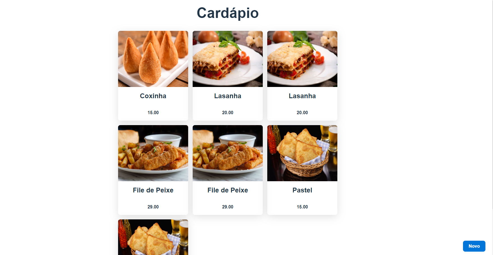
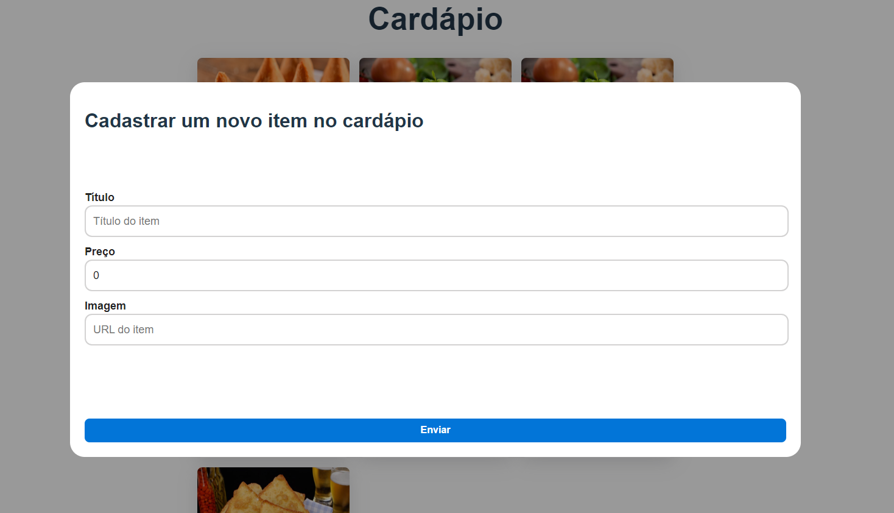

# Cardapio_Digital

Este projeto é um simples protótipo de um Cardápio Digital desenvolvido durante o tutorial da Fernanda Kipper [tutorial no YouTube](https://www.youtube.com/@kipperdev). A aplicação na aula foi desenvolvida usando **React, TypeScript e React Query**, mas estudei o código e mudei para **Vue 3.0, TypeScript e Vue Query** com fins de estudo. Além de utilizar **Java Spring** no back-end.

<h1 align="center">
    
    
</h1>

## 💻 Requisitos

Antes de iniciar, você deve ter o Node.js, NPM, JDK e JRE instalados em sua máquina.

## 🚀 Instalando

Primeiro, você deve clonar o projeto na sua máquina, para isso você
pode colar o seguinte comando em seu terminal

```bash
git clone https://github.com/SystemG1000/Cardapio_Digital.git
cd Cardapio_Digital
```

## Front-End

Depois de entrar na pasta "front-end", basta instalar as dependências e executar o código

```bash
cd front-end
npm install
npm run dev
```


## Back-End

Depois de entrar na pasta "back-end", basta instalar as dependências com o Maven e por fim, no arquivo da classe `CardapioApllication` para executar o projeto

```bash
cd back-end
```

## 📝 Licença

Este projeto está licenciado sob a licença MIT. Consulte o arquivo `LICENSE` para obter mais informações.